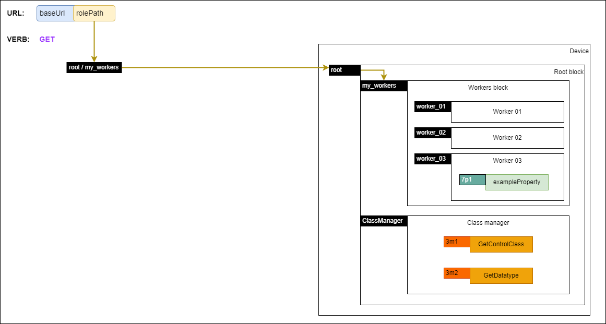

# API messaging

All message results MUST return a response which inherits from the base [NcMethodResult](https://specs.amwa.tv/ms-05-02/latest/docs/Framework.html#ncmethodresult) that contains a status of type [NcMethodStatus](https://specs.amwa.tv/ms-05-02/latest/docs/Framework.html#ncmethodstatus). If the method call encountered an error then the response result returned MUST inherit from [NcMethodResultError](https://specs.amwa.tv/ms-05-02/latest/docs/Framework.html#ncmethodresulterror) and include an errorMessage of type [NcString](https://specs.amwa.tv/ms-05-02/latest/docs/Framework.html#primitives).

## Control session

Concurrency control is left to specific device implementations, however devices MUST always return relevant error response messages and statuses when there are conflicts, errors or other noteworthy states (see [Error response messages](#error-response-messages)).

## URL and query parameters usage

The URL provided in the [IS-04 device](IS-04%20interactions.md) is used as the base URL for all subsequent requests.

The device model of the device can be navigated by appending [NcObject roles](https://specs.amwa.tv/ms-05-02/latest/docs/NcObject.html) on top of the base URL starting from the `root block` and using `/` as the delimiter.

Device model objects MUST not use the `/` character in their roles. Furthermore, device model objects roles MUST use `Unreserved Characters` as described in [RFC3986 - 2.3. Unreserved Characters](https://www.ietf.org/rfc/rfc3986.txt).

This means for a given base URL the `root` block can be targeted by using `{baseUrl}/root` as the URL.

Query parameters MUST be used to target properties or methods for a particular object located by URL.

This means using the base URL the [userLabel](https://specs.amwa.tv/ms-05-02/latest/docs/Framework.html#ncobject) of the `root` block can be targeted by using `{baseUrl}/root?level=1&index=6` as the URL.

All HTTP requests map to invoking methods on the resources located by the URL.

ALL HTTP responses MUST set the HTTP status code to the same code as the status property returned as part of [NcMethodResult](https://specs.amwa.tv/ms-05-02/latest/docs/Framework.html#ncmethodresult).

The following subsections define use cases for the applicable HTTP verbs where resources are located using a URL format where the following variables are defined:

- baseUrl - href advertised in the controls of the [IS-04 device](IS-04%20interactions.md)
- rolePath - string obtained by appending [NcObject roles](https://specs.amwa.tv/ms-05-02/latest/docs/NcObject.html) on top of the base URL starting from the `root block` and using `/` as the delimiter
- propertyLevel - number representing the inheritance level of the class containing the property (see [Control Classes](https://specs.amwa.tv/ms-05-02/latest/docs/Framework.html#control-classes))
- propertyIndex - number representing the index level of the property within the specified inheritance level (see [Control Classes](https://specs.amwa.tv/ms-05-02/latest/docs/Framework.html#control-classes))

## GET

### Getting a property

|  |
|:--:|
| _**Getting a property**_ |

| URL format                                                       | Condition                                                         | Response type                                                                                                                                          |
| -----------------------------------------------------------------| ----------------------------------------------------------------- | ------------------------------------------------------------------------------------------------------------------------------------------------------ |
| {baseUrl}/{rolePath}?level={propertyLevel}&index={propertyIndex} | The URL and query parameter target a specific object and property | [NcMethodResultPropertyValue](https://specs.amwa.tv/ms-05-02/latest/docs/Framework.html#ncmethodresultpropertyvalue) with the contents of the property |

The URL MUST target a specific property of an object by locating the object using its role path and adding `level` and `index` query parameters. The response MUST be of type [NcMethodResultPropertyValue](https://specs.amwa.tv/ms-05-02/latest/docs/Framework.html#ncmethodresultpropertyvalue) with the contents of that property.

This is equivalent to invoking the generic [Get method](https://specs.amwa.tv/ms-05-02/latest/docs/NcObject.html#generic-getter-and-setter) on the specific object for the required property.

### Getting the members of a block

|  |
|:--:|
| _**Getting block members**_ |

| URL format           | Condition                        | Response type                                                                                                                                                    |
| ---------------------| ---------------------------------| ---------------------------------------------------------------------------------------------------------------------------------------------------------------- |
| {baseUrl}/{rolePath} | The URL targets a specific block | [NcMethodResultPropertyValue](https://specs.amwa.tv/ms-05-02/latest/docs/Framework.html#ncmethodresultpropertyvalue) with the contents of the `members` property |

The URL MUST target a specific block object in the device model and MUST NOT contain any query parameters. Devices MUST treat this as a request to retrieve the [members](https://specs.amwa.tv/ms-05-02/latest/docs/Blocks.html#device-model-discovery) property of that block. The response MUST be of type [NcMethodResultPropertyValue](https://specs.amwa.tv/ms-05-02/latest/docs/Framework.html#ncmethodresultpropertyvalue) with the contents of the `members` property. The response MUST be the same to the one received when appending the `level` and `index` query parameters and targeting the `members` property as described in [Getting a property](#getting-a-property).

This is equivalent to invoking the generic [Get method](https://specs.amwa.tv/ms-05-02/latest/docs/NcObject.html#generic-getter-and-setter) on the specific object for the `members` property.

`TBD`: What to return when using that URL format but the located object is not a block? Do we say devices MUST then return the class descriptor instead or should we just return an error response with 404 and leave it to them to add the required query parameters?

### Getting the class descriptor of an object

|  |
|:--:|
| _**Getting class descriptor**_ |

| URL format                         | Condition                         | Response type                                                                                                            |
| -----------------------------------| ----------------------------------| -------------------------------------------------------------------------------------------------------------------------|
| {baseUrl}/{rolePath}?describe=true | The URL targets a specific object | [NcMethodResultClassDescriptor](https://specs.amwa.tv/ms-05-02/latest/docs/Framework.html#ncmethodresultclassdescriptor) |

The URL MUST target a specific object in the device model and include the `describe=true` query parameter. Devices treat this as a request to retrieve the [class descriptor](https://specs.amwa.tv/ms-05-02/latest/docs/Framework.html#ncclassdescriptor) of that object's class and MUST return a response of type [NcMethodResultClassDescriptor](https://specs.amwa.tv/ms-05-02/latest/docs/Framework.html#ncmethodresultclassdescriptor) with a descriptor which includes all inherited elements.

This is equivalent to invoking the [GetControlClass method](https://specs.amwa.tv/ms-05-02/latest/docs/Framework.html#ncclassmanager) on the [Class Manager object](https://specs.amwa.tv/ms-05-02/latest/docs/Managers.html#class-manager) and including all inherited elements.

### Getting the datatype descriptor of a property

|  |
|:--:|
| _**Getting datatype descriptor**_ |

| URL format                                                                     | Condition                         | Response type                                                                                                                  |
| -------------------------------------------------------------------------------| ----------------------------------| -------------------------------------------------------------------------------------------------------------------------------|
| {baseUrl}/{rolePath}?level={propertyLevel}&index={propertyIndex}&describe=true | The URL targets a specific object | [NcMethodResultDatatypeDescriptor](https://specs.amwa.tv/ms-05-02/latest/docs/Framework.html#ncmethodresultdatatypedescriptor) |

The URL MUST target a specific property of an object by locating the object using its role path and adding `level`, `index` and `describe=true` query parameters. Devices treat this as a request to retrieve the [datatype descriptor](https://specs.amwa.tv/ms-05-02/latest/docs/Framework.html#ncdatatypedescriptor) of that property and MUST return a response of type [NcMethodResultDatatypeDescriptor](https://specs.amwa.tv/ms-05-02/latest/docs/Framework.html#ncmethodresultdatatypedescriptor) with a descriptor which includes all inherited elements.

This is equivalent to invoking the [GetDatatype method](https://specs.amwa.tv/ms-05-02/latest/docs/Framework.html#ncclassmanager) on the [Class Manager object](https://specs.amwa.tv/ms-05-02/latest/docs/Managers.html#class-manager) and including all inherited elements.

## PUT

|  |
|:--:|
| _**Putting a property**_ |

| URL format                                                       | Condition                                        | Response type                                                                              |
| -----------------------------------------------------------------| -------------------------------------------------| -------------------------------------------------------------------------------------------|
| {baseUrl}/{rolePath}?level={propertyLevel}&index={propertyIndex} | The URL targets a specific property of an object | [NcMethodResult](https://specs.amwa.tv/ms-05-02/latest/docs/Framework.html#ncmethodresult) |

URL format: `{baseUrl}/{rolePath}?level={propertyLevel}&index={propertyIndex}`

The PUT verb MUST only be used for setting individual object properties.

The URL MUST target a specific property of an object by locating the object using its role path and adding `level` and `index` query parameters. The response MUST be of type [NcMethodResult](https://specs.amwa.tv/ms-05-02/latest/docs/Framework.html#ncmethodresult).

This is equivalent to invoking the generic [Set method](https://specs.amwa.tv/ms-05-02/latest/docs/NcObject.html#generic-getter-and-setter) on the specific object for the required property.

## PATCH

|  |
|:--:|
| _**Invoking a method**_ |

| URL format           | Condition                         | Body                                                                                       | Response type                                                                              |
| ---------------------| ----------------------------------| -------------------------------------------------------------------------------------------| -------------------------------------------------------------------------------------------|
| {baseUrl}/{rolePath} | The URL targets a specific object | [NcMethodResult](https://specs.amwa.tv/ms-05-02/latest/docs/Framework.html#ncmethodresult) | [NcMethodResult](https://specs.amwa.tv/ms-05-02/latest/docs/Framework.html#ncmethodresult) |

The PATCH verb MUST only be used for invoking object methods.

The URL MUST target a specific object by locating the object using its role path.
The body of the request MUST include an object which includes a [methodId](https://specs.amwa.tv/ms-05-02/latest/docs/Framework.html#ncmethodid) with `level` and `index` followed by any arguments required by the method.

```json
{
    "methodId": {
        "level": ...,
        "index": ...
    },
    "arguments": {
        ...
    }
}
```

For a full schema of the required body object see the [patch-body](https://specs.amwa.tv/is-device-configuration/branches/publish-CR/APIs/schemas/patch-body.html) schema.

The response MUST be of type [NcMethodResult](https://specs.amwa.tv/ms-05-02/latest/docs/Framework.html#ncmethodresult) or a derived type.

This is equivalent to invoking the specified method.

## Error response messages

When any request encounters an error, the response MUST be [NcMethodResultError](https://specs.amwa.tv/ms-05-02/latest/docs/Framework.html#ncmethodresulterror) or a derived datatype.
