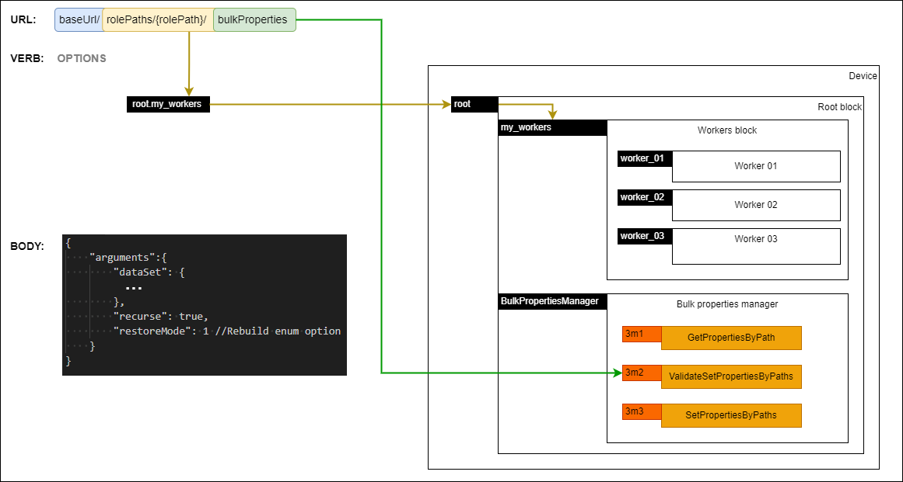

# API requests

The endpoints are documented in the [Configuration API](https://specs.amwa.tv/is-14/branches/v1.0-dev/APIs/ConfigurationAPI.html).

## Control session

Concurrency control is left to specific device implementations, however devices MUST always return relevant error response messages and statuses when there are conflicts, errors or other noteworthy states.

## URL and usage

The URL provided in the [IS-04 device](IS-04%20interactions.md) is used as the base URL for all subsequent requests.

As described in the Configuration API, the [rolePaths](https://specs.amwa.tv/is-14/branches/v1.0-dev/APIs/ConfigurationAPI.html#rolepaths_get) endpoint MUST return all the device model's role paths. Each `rolePath` MUST be created by appending [NcObject roles](https://specs.amwa.tv/ms-05-02/latest/docs/NcObject.html) starting with the `root block` and using `.` as the delimiter. Consequently the `.` character MUST not be used inside individual object roles.

It is RECOMMENDED for device model objects roles to use `Unreserved Characters` as described in [RFC 3986 - 2.3. Unreserved Characters](https://www.ietf.org/rfc/rfc3986.txt). When `Reserved Characters` are used in an object role, they MUST be URL encoded when included in the `rolePaths` endpoint and subsequently in a URL.

Device model object roles are case sensitive and thus any `rolePaths` and URLs which include them are also case sensitive as described in [RFC 7230](https://datatracker.ietf.org/doc/html/rfc7230#section-2.7.3).

Property identifiers are defined as `{propertyLevel}p{propertyIndex}` where:

- propertyLevel - number representing the inheritance level of the class containing the property (see [Control Classes](https://specs.amwa.tv/ms-05-02/latest/docs/Framework.html#control-classes))
- propertyIndex - number representing the index level of the property within the specified inheritance level (see [Control Classes](https://specs.amwa.tv/ms-05-02/latest/docs/Framework.html#control-classes))

Method identifiers are fined as `{methodLevel}m{methodIndex}` where:

- methodLevel - number representing the inheritance level of the class containing the method (see [Control Classes](https://specs.amwa.tv/ms-05-02/latest/docs/Framework.html#control-classes))
- methodIndex - number representing the index level of the method within the specified inheritance level (see [Control Classes](https://specs.amwa.tv/ms-05-02/latest/docs/Framework.html#control-classes))

This means for a given base URL the `root` block can be targeted by using `{baseUrl}/root` as the URL. Furthermore, the [userLabel](https://specs.amwa.tv/ms-05-02/latest/docs/Framework.html#ncobject) of the `root` block can be targeted by using `{baseUrl}/rolePaths/root/properties/1p6/value` as the URL.

The following subsections define common use cases for the applicable HTTP verbs where resources are located using their associated `rolePath`.

| Verb    | Scenario                                                                                                | URL format                                                      | Body                                                                                                                               | Response                                                                                                                                                                                               |
| ------- | ------------------------------------------------------------------------------------------------------- | --------------------------------------------------------------- | ---------------------------------------------------------------------------------------------------------------------------------- | ------------------------------------------------------------------------------------------------------------------------------------------------------------------------------------------------------ |
| GET     | [Get a property](#getting-a-property)                                                                   | baseUrl/rolePaths/{rolePath}/properties/{propertyId}/value      | N/A                                                                                                                                | [NcMethodResultPropertyValue](https://specs.amwa.tv/ms-05-02/latest/docs/Framework.html#ncmethodresultpropertyvalue) with the contents of the property                                                 |
| GET     | [Get class descriptor](#getting-the-class-descriptor-of-an-object)                                      | baseUrl/rolePaths/{rolePath}/descriptor                         | N/A                                                                                                                                | [NcMethodResultClassDescriptor](https://specs.amwa.tv/ms-05-02/latest/docs/Framework.html#ncmethodresultclassdescriptor)                                                                               |
| GET     | [Get datatype descriptor](#getting-the-datatype-descriptor-of-a-property)                               | baseUrl/rolePaths/{rolePath}/properties/{propertyId}/descriptor | N/A                                                                                                                                | [NcMethodResultDatatypeDescriptor](https://specs.amwa.tv/ms-05-02/latest/docs/Framework.html#ncmethodresultdatatypedescriptor)                                                                         |
| GET     | [Getting all the properties of a role path](#getting-all-the-properties-of-a-role-path)                 | baseUrl/rolePaths/{rolePath}/bulkProperties?recurse={value}     | N/A                                                                                                                                | [NcMethodResultBulkValuesHolder](https://specs.amwa.tv/nmos-control-feature-sets/branches/publish-device-configuration/device-configuration/#ncmethodresultbulkvaluesholder)                           |
| PUT     | [Modify a property](#changing-a-property)                                                               | baseUrl/rolePaths/{rolePath}/properties/{propertyId}/value      | [property-value-put-request](https://specs.amwa.tv/is-14/branches/v1.0-dev/APIs/schemas/property-value-put-request.json)           | [NcMethodResult](https://specs.amwa.tv/ms-05-02/latest/docs/Framework.html#ncmethodresult)                                                                                                             |
| PUT     | [Setting bulk properties for a role path](#setting-bulk-properties-for-a-role-path)       | baseUrl/rolePaths/{rolePath}/bulkProperties                     | [bulkProperties-set-request](https://specs.amwa.tv/is-14/branches/v1.0-dev/APIs/schemas/bulkProperties-set-request.json)           | [NcMethodResultObjectPropertiesSetValidation](https://specs.amwa.tv/nmos-control-feature-sets/branches/publish-device-configuration/device-configuration/#ncmethodresultobjectpropertiessetvalidation) |
| PATCH   | [Invoke a method](#invoking-a-method)                                                                   | baseUrl/rolePaths/{rolePath}/methods/{methodId}                 | [method-patch-request](https://specs.amwa.tv/is-14/branches/v1.0-dev/APIs/schemas/method-patch-request.json)                       | [NcMethodResult](https://specs.amwa.tv/ms-05-02/latest/docs/Framework.html#ncmethodresult)                                                                                                             |
| PATCH | [Validating bulk properties for a role path](#validating-bulk-properties-for-a-role-path) | baseUrl/rolePaths/{rolePath}/bulkProperties                     | [bulkProperties-validate-request](https://specs.amwa.tv/is-14/branches/v1.0-dev/APIs/schemas/bulkProperties-validate-request.json) | [NcMethodResultObjectPropertiesSetValidation](https://specs.amwa.tv/nmos-control-feature-sets/branches/publish-device-configuration/device-configuration/#ncmethodresultobjectpropertiessetvalidation) |

## GET

### Getting a property

|  |
|:--:|
| _**Getting a property**_ |

The URL MUST target a specific property of an object by locating the object using its role path and the property using its propertyId. The response MUST be of type [NcMethodResultPropertyValue](https://specs.amwa.tv/ms-05-02/latest/docs/Framework.html#ncmethodresultpropertyvalue) with the contents of that property. If the request encountered an error then the response result returned MUST inherit from [NcMethodResultError](https://specs.amwa.tv/ms-05-02/latest/docs/Framework.html#ncmethodresulterror) and include an errorMessage of type [NcString](https://specs.amwa.tv/ms-05-02/latest/docs/Framework.html#primitives).

This is equivalent to invoking the generic [Get method](https://specs.amwa.tv/ms-05-02/latest/docs/NcObject.html#generic-getter-and-setter) on the specific object for the required property.

### Getting the class descriptor of an object

|  |
|:--:|
| _**Getting class descriptor**_ |

The URL MUST target a specific object in the device model. Devices treat this as a request to retrieve the [class descriptor](https://specs.amwa.tv/ms-05-02/latest/docs/Framework.html#ncclassdescriptor) of that object's class and MUST return a response of type [NcMethodResultClassDescriptor](https://specs.amwa.tv/ms-05-02/latest/docs/Framework.html#ncmethodresultclassdescriptor) with a descriptor which includes all inherited elements. If the request encountered an error then the response result returned MUST inherit from [NcMethodResultError](https://specs.amwa.tv/ms-05-02/latest/docs/Framework.html#ncmethodresulterror) and include an errorMessage of type [NcString](https://specs.amwa.tv/ms-05-02/latest/docs/Framework.html#primitives).

This is equivalent to invoking the [GetControlClass method](https://specs.amwa.tv/ms-05-02/latest/docs/Framework.html#ncclassmanager) on the [Class Manager object](https://specs.amwa.tv/ms-05-02/latest/docs/Managers.html#class-manager) and including all inherited elements.

### Getting the datatype descriptor of a property

|  |
|:--:|
| _**Getting datatype descriptor**_ |

The URL MUST target a specific property of an object by locating the object using its role path and the property using its propertyId. Devices treat this as a request to retrieve the [datatype descriptor](https://specs.amwa.tv/ms-05-02/latest/docs/Framework.html#ncdatatypedescriptor) of that property and MUST return a response of type [NcMethodResultDatatypeDescriptor](https://specs.amwa.tv/ms-05-02/latest/docs/Framework.html#ncmethodresultdatatypedescriptor) with a descriptor which includes all inherited elements. If the request encountered an error then the response result returned MUST inherit from [NcMethodResultError](https://specs.amwa.tv/ms-05-02/latest/docs/Framework.html#ncmethodresulterror) and include an errorMessage of type [NcString](https://specs.amwa.tv/ms-05-02/latest/docs/Framework.html#primitives).

This is equivalent to invoking the [GetDatatype method](https://specs.amwa.tv/ms-05-02/latest/docs/Framework.html#ncclassmanager) on the [Class Manager object](https://specs.amwa.tv/ms-05-02/latest/docs/Managers.html#class-manager) and including all inherited elements.

### Getting all the properties of a role path

|  |
|:--:|
| _**Getting bulk properties**_ |

The URL MUST target a specific role path in the device model. This MUST retrieve all the properties of that role path as a [bulk values holder](https://specs.amwa.tv/nmos-control-feature-sets/branches/publish-device-configuration/device-configuration/#ncbulkvaluesholder) and MUST return a response of type [NcMethodResultBulkValuesHolder](https://specs.amwa.tv/nmos-control-feature-sets/branches/publish-device-configuration/device-configuration/#ncmethodresultbulkvaluesholder). If the `recurse` query parameter is set to `true` then the response MUST include the values of the target role path as well as any nested role paths. Not including the `recurse` query parameter MUST be treated as providing a `recurse` value of `true`. If the request encountered an error then the response result returned MUST inherit from [NcMethodResultError](https://specs.amwa.tv/ms-05-02/latest/docs/Framework.html#ncmethodresulterror) and include an `errorMessage` of type [NcString](https://specs.amwa.tv/ms-05-02/latest/docs/Framework.html#primitives). If devices cannot accept backup requests due to temporary internal constraints (e.g. requires to be in maintenance mode) then they MUST use a status of `NotReady` and supply further details on the reason for this in the `errorMessage`.

This is equivalent to invoking the `GetPropertiesByPath` method on the [Bulk properties manager object](https://specs.amwa.tv/nmos-control-feature-sets/branches/publish-device-configuration/device-configuration/#ncbulkpropertiesmanager).

Retrieving properties through the `bulkProperties` endpoint allows a user to perform a `full backup` or a `partial backup`.

A `full backup` is a [backup data set](Backup%20&%20restore.md#definitions) returned by a `GET` operation on the `/bulkProperties` endpoint of the root block with the `recurse` parameter set to true.

A `partial backup` is a [backup data set](Backup%20&%20restore.md#definitions) returned by a `GET` operation on the `/bulkProperties` endpoint of any object of the device model, other than the root block. A partial backup can also be obtained by a `GET` operation on the `/bulkProperties` endpoint of the root block with the `recurse` query parameter set to false; however this will only result in a backup of the root block only.

## PUT

### Changing a property

|  |
|:--:|
| _**Putting a property**_ |

The PUT verb MUST be used for setting individual object properties.

The URL MUST target a specific property of an object by locating the object using its role path and the property using its propertyId. The response MUST be of type [NcMethodResult](https://specs.amwa.tv/ms-05-02/latest/docs/Framework.html#ncmethodresult). If the request encountered an error then the response result returned MUST inherit from [NcMethodResultError](https://specs.amwa.tv/ms-05-02/latest/docs/Framework.html#ncmethodresulterror) and include an errorMessage of type [NcString](https://specs.amwa.tv/ms-05-02/latest/docs/Framework.html#primitives).

The body of the request MUST include an object which includes the new value of the property as per the [property-value-put-request](https://specs.amwa.tv/is-14/branches/v1.0-dev/APIs/schemas/property-value-put-request.json) schema.

This is equivalent to invoking the generic [Set method](https://specs.amwa.tv/ms-05-02/latest/docs/NcObject.html#generic-getter-and-setter) on the specific object for the required property.

### Setting bulk properties for a role path

|  |
|:--:|
| _**Setting bulk properties**_ |

The PUT verb MUST be used for setting a bulk properties data set.

The URL MUST target a specific role path.
The body of the request MUST include an object which includes an `arguments` object with `dataSet`, `recurse` and `restoreMode` sub elements.

```json
{
    "arguments": {
        "dataSet": {
            ...
        },
        "recurse": true,
        "restoreMode": 1
    }
}
```

If the `recurse` value is `true` then the device will attempt to use the provided `dataSet` to set the properties of the target role path and all nested role paths.

For a full schema of the required body object see the [bulkProperties-set-request](https://specs.amwa.tv/is-14/branches/v1.0-dev/APIs/schemas/bulkProperties-set-request.json) schema.

The response MUST be of type [NcMethodResultObjectPropertiesSetValidation](https://specs.amwa.tv/nmos-control-feature-sets/branches/publish-device-configuration/device-configuration/#ncmethodresultobjectpropertiessetvalidation). If the request encountered an error then the response result returned MUST inherit from [NcMethodResultError](https://specs.amwa.tv/ms-05-02/latest/docs/Framework.html#ncmethodresulterror) and include an errorMessage of type [NcString](https://specs.amwa.tv/ms-05-02/latest/docs/Framework.html#primitives). If devices cannot accept restore requests due to temporary internal constraints then they MUST use a status of `NotReady` and supply further details on the reason for this in the errorMessage.

This is equivalent to invoking the `SetPropertiesByPath` method inside the [Bulk properties manager object](https://specs.amwa.tv/nmos-control-feature-sets/branches/publish-device-configuration/device-configuration/#ncbulkpropertiesmanager).

Setting properties through the `bulkProperties` endpoint allows a user to perform a restore.

## PATCH

### Invoking a method

|  |
|:--:|
| _**Invoking a method**_ |

The PATCH verb MUST be used for invoking object methods.

The URL MUST target a specific object by locating the object using its role path.
The body of the request MUST include an object which includes an `arguments` object. For methods which do not have arguments defined the request body MUST include an empty `arguments` object.

```json
{
    "arguments": {
        ...
    }
}
```

For a full schema of the required body object see the [method-patch-request](https://specs.amwa.tv/is-14/branches/v1.0-dev/APIs/schemas/method-patch-request.json) schema.

The response MUST be of type [NcMethodResult](https://specs.amwa.tv/ms-05-02/latest/docs/Framework.html#ncmethodresult) or a derived type. If the request encountered an error then the response result returned MUST inherit from [NcMethodResultError](https://specs.amwa.tv/ms-05-02/latest/docs/Framework.html#ncmethodresulterror) and include an errorMessage of type [NcString](https://specs.amwa.tv/ms-05-02/latest/docs/Framework.html#primitives).

This is equivalent to invoking the specified method.

### Validating bulk properties for a role path

|  |
|:--:|
| _**Validating bulk properties**_ |

The PATCH verb MUST be used for validating a bulk properties data set.

The URL MUST target a specific role path.
The body of the request MUST include an object which includes an `arguments` object with `dataSet`, `recurse` and `restoreMode` sub elements.

```json
{
    "arguments": {
        "dataSet": {
            ...
        },
        "recurse": true,
        "restoreMode": 1
    }
}
```

If the `recurse` value is `true` then the device will attempt to use the provided `dataSet` to validate the target role path and all nested role paths.

For a full schema of the required body object see the [bulkProperties-validate-request](https://specs.amwa.tv/is-14/branches/v1.0-dev/APIs/schemas/bulkProperties-validate-request.json) schema.

The response MUST be of type [NcMethodResultObjectPropertiesSetValidation](https://specs.amwa.tv/nmos-control-feature-sets/branches/publish-device-configuration/device-configuration/#ncmethodresultobjectpropertiessetvalidation). If the request encountered an error then the response result returned MUST inherit from [NcMethodResultError](https://specs.amwa.tv/ms-05-02/latest/docs/Framework.html#ncmethodresulterror) and include an errorMessage of type [NcString](https://specs.amwa.tv/ms-05-02/latest/docs/Framework.html#primitives).

This is equivalent to invoking the `ValidateSetPropertiesByPath` method inside the [Bulk properties manager object](https://specs.amwa.tv/nmos-control-feature-sets/branches/publish-device-configuration/device-configuration/#ncbulkpropertiesmanager).
