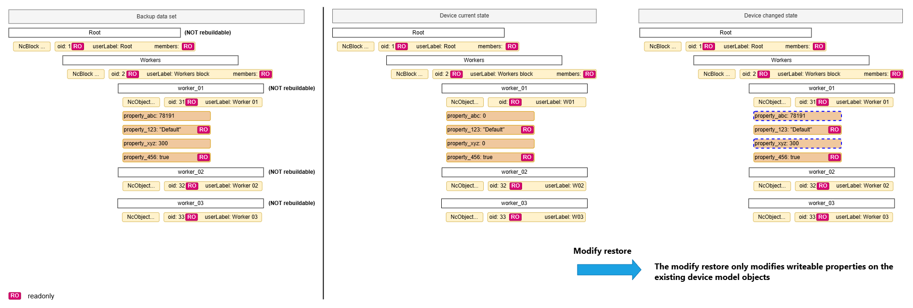
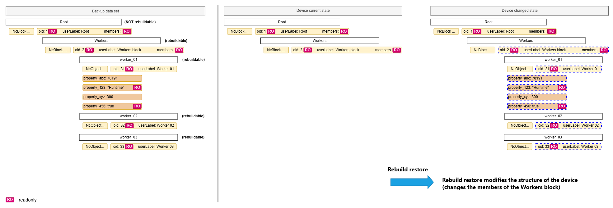

# Backup & restore

Supporting backup & restore is a key feature of IS-14. To discuss the various possible combinations of backup and restore, this section utilizes terms explained in the [Definitions](#definitions) section.

The [Configuration API](https://specs.amwa.tv/is-14/branches/v1.0-dev/APIs/ConfigurationAPI.html) defines a `bulkProperties` endpoint which allows:

- [Getting all the properties of a role path](https://specs.amwa.tv/is-14/branches/v1.0-dev/docs/API_requests.html#getting-all-the-properties-of-a-role-path)
- [Setting bulk properties for a role path](https://specs.amwa.tv/is-14/branches/v1.0-dev/docs/API_requests.html#setting-bulk-properties-for-a-role-path)
- [Validating bulk properties for a role path](https://specs.amwa.tv/is-14/branches/v1.0-dev/docs/API_requests.html#validating-bulk-properties-for-a-role-path)

These mechanisms are used for enabling backup and restore functionality and this section of the specification aims to cover the expectations, behaviour and requirements for the following scenarios:

- [Performing a backup](#performing-a-backup)
- Performing a [Modify restore](#performing-a-modify-restore)
- Performing a [Rebuild restore](#performing-a-rebuild-restore)

`Note`: This does not mean that the backup & restore functionality can only be used in these scenarios.

## Definitions

A `device`, for the purposes of this section, is a physical or logical entity that can be backed up and restored using the procedures described. It may or may not correspond to an IS-04 Device or IS-04 Node.

`Backup data set` is the set of data retrieved from a device using the backup procedures described. This is represented as an [NcBulkValuesHolder](https://specs.amwa.tv/nmos-control-feature-sets/branches/publish-device-configuration/device-configuration/#ncbulkvaluesholder) object.

`Backup validation fingerprint` is an optional string in a `backup data set` that can be used to capture the various versions of the hardware, software and/or firmware that made up a device at the time the backup was performed. The format of the string is defined by the vendor and is opaque to other systems. This could contain information such as:

- Manufacturer key
- Product key
- Software versions
- Hardware revisions
- Backup response hash
- Timestamp
- Whether its a full device model backup or a partial backup

A `device model` in the context of this specification refers to all the objects and their properties which are exposed in the configuration API.

A `full backup` is a `backup data set` that includes all properties for all role paths of a device model. This is achieved by using the [/bulkProperties endpoint](https://specs.amwa.tv/is-14/branches/v1.0-dev/docs/API_requests.html#getting-all-the-properties-of-a-role-path).

A `partial backup` is a `backup data set` that includes only a subset of role paths of a device model. This is achieved by using the [/bulkProperties endpoint](https://specs.amwa.tv/is-14/branches/v1.0-dev/docs/API_requests.html#getting-all-the-properties-of-a-role-path).

A `modified backup` is a `full backup` or `partial backup` where the backup data set has been modified by a client. Examples of modified backups include: updating values of existing backup data set properties, adding/removing device model role paths from the backup data set.

## General concepts

Role path objects within a backup data set contain a boolean property called `isRebuildable`.  
If the object is a non-block object `isRebuildable` means the object's readonly properties can be modified.  
If the object is a block, `isRebuildable` depicts it can be modified as mentioned before but also that its members can be added or removed (new instances of rebuildable objects can be created in a rebuildable parent block).  
When a parent block object is not rebuildable but a member child is rebuildable the implication is that the child cannot change its role within that block when being rebuilt through a restore.  
Members of a rebuildable block which are not rebuildable cannot be removed.

and new instances of that object can be created in a rebuildable parent block.

The restore mechanism achieved by [Setting bulk properties for a role path](https://specs.amwa.tv/is-14/branches/v1.0-dev/docs/API_requests.html#setting-bulk-properties-for-a-role-path) affects the device model by either rebuilding it or modifying it.

Validating a restore operation before applying it is achieved by [Validating bulk properties for a role path](https://specs.amwa.tv/is-14/branches/v1.0-dev/docs/API_requests.html#validating-bulk-properties-for-a-role-path). Implementations MUST perform the same checks and offer the same response as if the restore was being applied without actually performing changes to the device model objects.

A restore with the restore mode set to `Modify` MUST only be allowed to make changes to existing writeable properties of existing device model objects and MUST NOT modify the device model in a structural way (cannot cause the addition or removal of objects from blocks). Furthermore, devices are RECOMMENDED to evaluate a `Modify` restore (validate if the restore can happen) even when the backup data set contains readonly properties since writeable properties might result in the desired changes being applied and the readonly properties will result in notices in the response returned.

A restore with the restore mode set to `Rebuild` MUST allow the following actions:

- make changes to existing writeable properties of existing device model objects
- add new members to rebuildable block objects by constructing new member objects (structural changes)
- remove existing members from rebuildable block objects by deconstructing the member objects (structural changes)
- reconstruct existing rebuildable objects (constructing fresh objects which can accept changes even to its readonly properties)

`Rebuild` restores can perform structural changes against rebuildable device models in the following ways:

- an object can be removed from a rebuildable block when the backup data set used in the restore offers a collection of members for the block which does not include the object (the success of this operation MAY depend on the internal constraints of the device - some devices might have have some members which cannot be removed or a minimum number of members).
- an object can be added to a rebuildable block when the backup data set used in the restore offers a collection of members for the block which includes the new object and also includes a new entry for the role path of the new object with its properties (the success of this operation MAY depend on the internal constraints of the device - devices are likely to check whether the new object class and role can be added to the block, whether they have all the necessary information to construct the new object, and might even check against a maximum number of members).

In the interest of interoperability even devices with no `rebuildable` device model objects MUST accept `Rebuild` restores but only perform changes to writeable properties of device model objects whilst including notices for any other changes not supported by the device.

The rules for devices implementing the restore workflow are:

- after a restore operation devices MUST always contain valid objects (objects which have suitable values for each property within the current operating context) in their device models
- a restore operation modifying/rebuilding an object can use information from the backup data set provided or from an internal knowledge store
- a restore operation modifying/rebuilding an object which uses only the backup data set information MUST report the role path restore status as `Ok`
- a restore operation modifying/rebuilding an object which uses internal knowledge store information MUST report the role path restore status as `Ok` and list properties which have benefited from internal knowledge store data in the [notices](https://specs.amwa.tv/nmos-control-feature-sets/branches/publish-device-configuration/device-configuration/#ncpropertyrestorenotice) property as `Warning` notices
- if devices cannot find the required information for modifying/rebuilding a particular object in either the backup data set provided or an internal knowledge store, then they MUST report the role path restore status as `Failed` and also MUST populate the `statusMessage` property with details of why the operation failed. Devices MAY also populate [notices](https://specs.amwa.tv/nmos-control-feature-sets/branches/publish-device-configuration/device-configuration/#ncpropertyrestorenotice) for the object properties which have contributed to the operation failing.
- a restore operation modifying/rebuilding an object resulting in at least one error [notice](https://specs.amwa.tv/nmos-control-feature-sets/branches/publish-device-configuration/device-configuration/#ncpropertyrestorenotice) MUST report the role path restore status as `Failed`
- a restore operation modifying/rebuilding an object resulting only in warning [notices](https://specs.amwa.tv/nmos-control-feature-sets/branches/publish-device-configuration/device-configuration/#ncpropertyrestorenotice) MUST report the role path restore status as `Ok`

## Performing a backup

Creating a backup is performed by using the `bulkProperties` endpoint of a device alongside the [Get verb](https://specs.amwa.tv/is-14/branches/v1.0-dev/docs/API_requests.html#getting-all-the-properties-of-a-role-path).

In order to retrieve the whole device model (full backup), requests MUST use `root` as the `rolePath` and a `recurse` parameter with a value of `true`. The response contains a `validationFingerprint` and the `values` of all the role paths in the device model.

|  |
|:--:|
| _**Performing a full backup**_ |

Partial backups can be created by choosing other role paths. The scope of backups can further be restricted by using a query parameter of `recurse=false` which will only include the properties of the targeted role path.

Devices are RECOMMENDED to populate `dependencyPaths` for objects which have dependencies on other role path objects when returning a backup data set ([see NcObjectPropertiesHolder](https://specs.amwa.tv/nmos-control-feature-sets/branches/publish-device-configuration/device-configuration/#ncobjectpropertiesholder)).

## Performing a Modify restore

The following sections describe how a `Modify` restore can be performed using a backup data set as detailed in [performing a backup](#performing-a-backup).

Clients are RECOMMENDED to [Validate the restore operation](https://specs.amwa.tv/is-14/branches/v1.0-dev/docs/API_requests.html#validating-bulk-properties-for-a-role-path) before attempting to apply the changes.

In order to validate applying the full backup data set against the device model, requests MUST use `root` as the `rolePath`.

The request body MUST include:

- the backup dataSet
- a boolean `recurse` argument (set to `true` for validating the entire device model)
- the `restoreMode` argument (set to `Modify` in order to only allow changes to writeable properties)

A restore operation is performed through a [Set request](https://specs.amwa.tv/is-14/branches/v1.0-dev/docs/API_requests.html#setting-bulk-properties-for-a-role-path) to restore a backup data set.

In order to restore the full backup data set to the device model, the request MUST use `root` as the `rolePath`.

The request body MUST include:

- the backup dataSet
- a boolean `recurse` argument (set to `true` for validating the entire device model)
- the `restoreMode` argument (set to `Modify` in order to only allow changes to writeable properties)

If a device requires a system reboot in order to apply the restore then it MUST perform this immediately after responding to the restore request.

The diagram below captures how the `Modify` restore uses the backup data set to transition the device from its current device model to a changed state.

|  |
|:--:|
| _**Modify restore**_ |

## Performing a Rebuild restore

Rebuild restores are the only way to make structural changes to a device model. Structural changes are only allowed for rebuildable blocks.

The following sections describe how a `Rebuild` restore can be performed using a backup data set as detailed in [performing a backup](#performing-a-backup).

Clients are RECOMMENDED to [Validate the restore operation](https://specs.amwa.tv/is-14/branches/v1.0-dev/docs/API_requests.html#validating-bulk-properties-for-a-role-path) before attempting to apply the changes.

In order to validate applying the full backup data set against the device model, the request MUST use `root` as the `rolePath`.

The request body MUST include:

- the backup dataSet
- a boolean `recurse` argument (set to `true` for validating the entire device model)
- the `restoreMode` argument (set to `Rebuild` in order to allow blocks to be repopulated with the same members as per the original device)

A restore operation is performed through a [Set request](https://specs.amwa.tv/is-14/branches/v1.0-dev/docs/API_requests.html#setting-bulk-properties-for-a-role-path) to restore a backup data set.

In order to restore the full backup data set to the device model, requests MUST use `root` as the `rolePath`.

The request body MUST include:

- the backup dataSet
- a boolean `recurse` argument (set to `true` for validating the entire device model)
- the `restoreMode` argument (set to `Rebuild` in order to allow blocks to be repopulated with the same members as per the original device)

If a device requires a system reboot in order to apply the restore then it MUST perform this immediately after responding to the restore request.

The diagram below captures how the `Rebuild` restore uses the backup data set to transition the device from its current device model to a changed state. In this case the operation makes a structural change to the device model.

|  |
|:--:|
| _**Rebuild restore**_ |
