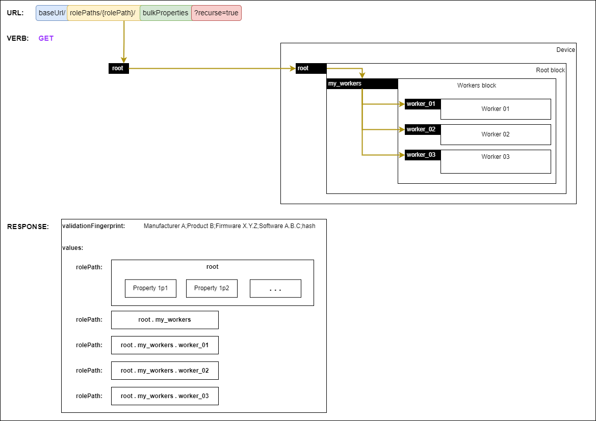
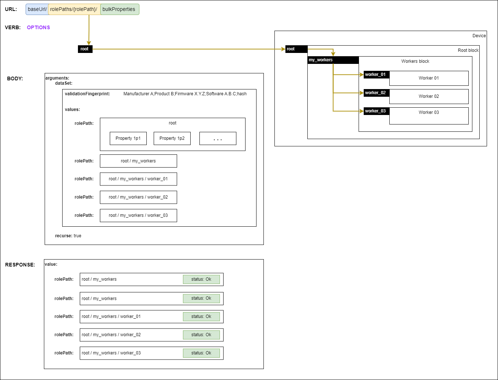
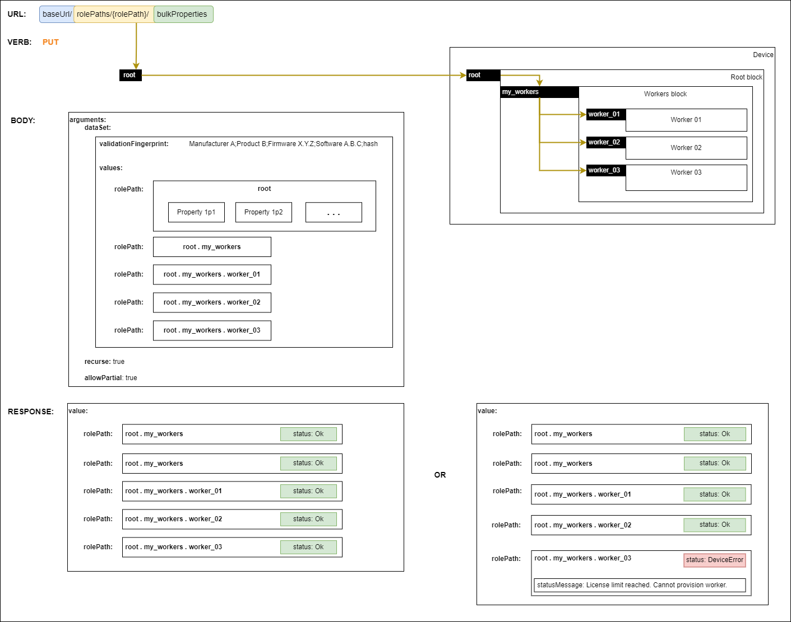
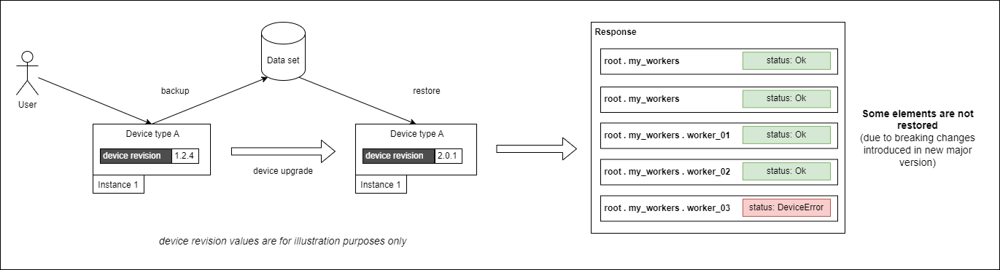

# Backup & restore

Supporting backup & restore is a key feature of IS-14. In addition to supporting full back and full restore to the same device, IS-14 enables partial backup and partial restore to the same device or a different device. To discuss the various possible combinations of backup and restore, this section utilizes terms explained in the [Definitions](#definitions) section.

The [Configuration API](https://specs.amwa.tv/is-14/branches/v1.0-dev/APIs/ConfigurationAPI.html) defines a `bulkProperties` endpoint which allows:

- [Getting all the properties of a role path](https://specs.amwa.tv/is-14/branches/v1.0-dev/docs/API_requests.html#getting-all-the-properties-of-a-role-path)
- [Setting bulk properties for a role path](https://specs.amwa.tv/is-14/branches/v1.0-dev/docs/API_requests.html#setting-bulk-properties-for-a-role-path)
- [Validating bulk properties for a role path](https://specs.amwa.tv/is-14/branches/v1.0-dev/docs/API_requests.html#validating-bulk-properties-for-a-role-path)

These mechanisms are used for enabling backup and restore functionality and this section of the specification aims to cover the expectations, behaviour and requirements for the following scenarios:

- [Performing a backup](#1-performing-a-backup)
- Restoring on a [device with a compatible revision](#2-restoring-on-a-device-with-a-compatible-revision)
- Restoring on a [device with an incompatible revision](#3-restoring-on-a-device-with-an-incompatible-revision)

`Note`: This does not mean that the backup & restore functionality can only be used in these scenarios.

## 1. Performing a backup

Creating a backup is performed by using the `bulkProperties` endpoint of a device alongside the [Get verb](https://specs.amwa.tv/is-14/branches/v1.0-dev/docs/API_requests.html#getting-all-the-properties-of-a-role-path).

In order to retrieve the whole device model (full backup), requests MUST use `root` as the `rolePath`. The response contains a `validationFingerprint` and the `values` of all the role paths in the device model.

|  |
|:--:|
| _**Performing a full backup**_ |

Partial backups can be created by choosing other role paths. The scope of backups can further be restricted by using a query parameter of `recurse=false` which will only include the properties of the targeted role path.

It is RECOMMENDED to store the backup file in its entirety and not remove elements from the data set as they might contain dependencies required by some of the role paths.

## 2. Restoring on a device with a compatible revision

Assuming a [full backup](#1-performing-a-backup) of the device was created and is intended to be restored on a device with a compatible revision then the first step is to perform a [Validation request](https://specs.amwa.tv/is-14/branches/v1.0-dev/docs/API_requests.html#validating-bulk-properties-for-a-role-path) to check if the backup can be successfully restored.

In order to validate the whole device model (validating a full backup), requests MUST use `root` as the `rolePath`.

The request body MUST include:

- the backup dataSet
- a boolean `recurse` argument (set to `true` for validating the whole device model)

|  |
|:--:|
| _**Validating a full backup**_ |

The response MUST include a collection of all target device model role paths with a validation `status` property. For role paths which have a `status` other than `Ok` the response MUST also include a `statusMessage` with details of why the validation failed.

The backup can be restored by performing a [Set request](https://specs.amwa.tv/is-14/branches/v1.0-dev/docs/API_requests.html#setting-bulk-properties-for-a-role-path) to restore the backup.

In order to restore the whole device model (restoring a full backup), requests MUST use `root` as the `rolePath`.

The request body MUST include:

- the backup dataSet
- a boolean `recurse` argument (set to `true` for validating the whole device model)
- a boolean `allowPartial` argument. This allows clients to control if the device should still perform a partial restore when some role paths fail validation (only the role paths which have been validated successfully are restored)

|  |
|:--:|
| _**Restoring a full backup**_ |

The response MUST include a collection of all target device model role paths with a restore `status` property. For role paths which have a `status` other than `Ok` the response MUST also include a `statusMessage` with details of why the restore failed.

Devices MUST allow fully restoring backups created from a `compatible revision`.

Devices MUST allow the partial restoration of backups which have at least one role path `status` of `Ok` when supplying the `allowPartial` argument of `true` in the request.

Devices MUST allow restoration of modified backups (full or partial backups where the data sets have been modified by a controller or provisioning tool) which have at least one role path `status` of `Ok` when supplying the `allowPartial` argument of `true` in the request.

// TBD: Do we need to further define what a modified backup is?

// TBD: Do we think some devices may need to be put in maintenance mode for restore to work?

// TBD: Do we think some devices may need to reboot in order to apply a restore?

## 3. Restoring on a device with an incompatible revision

Restoring follows a similar [workflow](#2-restoring-on-a-device-with-a-compatible-revision) with the difference that the restore device does not have a compatible revision.

|  |
|:--:|
| _**Restoring on a different device revision**_ |

Devices MUST allow the partial restoration of backups which have at least one role path `status` of `Ok` when supplying the `allowPartial` argument of `true` in the request.

// TBD: Facilities can have a multitude of instances of the same device type. Backups performed on a device instance can be used to bootstrap other instances of the same device type. What if the new device overwrites things like IP addresses? Are we saying the restore should be used as a bootstrap mechanism (do we need a isTemplate boolean flag when restoring)?

## Definitions

A `device`, for the purposes of this section, is a physical or logical entity that can be backed up and restored using the procedures described. It may or may not correspond to an IS-04 Device or IS-04 Node.

`Backup data set` is the set of data retrieved from a device using the backup procedures described.

`Device revision` represents any combination of software versions (this includes firmware) and hardware revision that dictates the functionality of the device. As a vendor evolves a product through its lifecycle the hardware, software and/or firmware that make up a device is likely to change. From time to time customers install new software or firmware issued by the vendor that changes how a device behaves. Changes to a device's hardware, such a peripherals or plug-in cards added or removed, could also change its behaviour. Each of these changes can affect how easily a `backup data set` is restored to a device. The `device revision` is used to represent the ensemble of the versions of all the various components that affect a device’s functionality. It is up to a vendor to decide what changes to a device represent a change of `device revision`. A software upgrade will likely result in a device being considered to have a different `device revision` but a vendor could decide that a change in, for example, PCB colour does not represent a different `device revision`.

`Backup validation fingerprint` is an optional string in a `backup data set` that can be used to capture the various versions of the hardware, software and/or firmware that made up a device at the time the backup was performed. The `backup validation fingerprint` can be used by a device to help decide whether the `backup data set` being restored to it is compatible. The format of the string is defined by the vendor and is opaque to other systems. This could contain information such as:

- Manufacturer key
- Product key
- Software versions
- Hardware revisions
- Backup response hash
- Timestamp
- Whether its a full device model backup or a subset

A `compatible revision` is a change of `device revision` such that all of the `backup data set` taken before the revision can be successfully validated by the modified device. If the `backup data set` can not be successfully validated it is said to be an `incompatible revision`.
